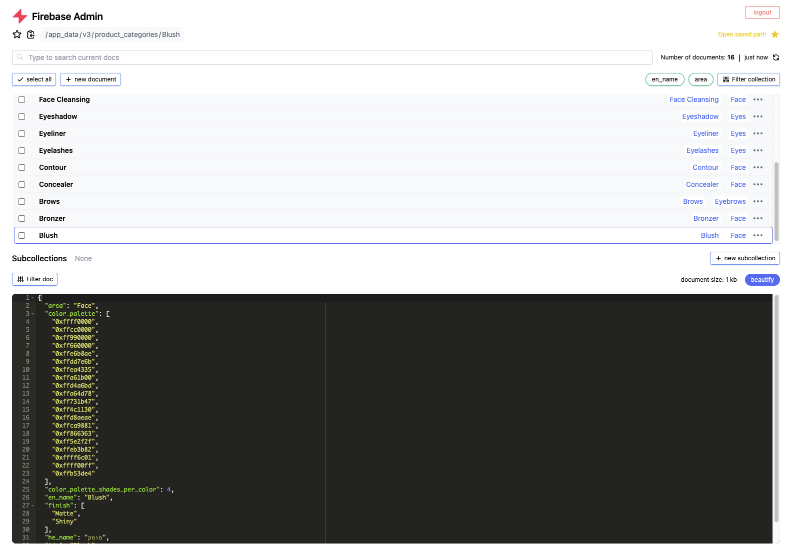

# Firebase Admin



## Introduction
The official Firebase console is a great tool to manage your account.
But managing Firebase Firestore Database can get a bit challenging for more advanced use cases.

Firebase Admin solves some of these challenges but adding functionality and improving the user experience.
Things you can do with Firebase Admin:
- Anything you can do using Firebase Console
- Easily remove a document, a group of documents or an entire collections
- Rename documents
- Clone documents
- Edit documents using a json like interface
- Quick view multiple parameters for all documents in a collection simultaneously, and filter or sort by them
- Search documents in a collection
- Click a link to a photo to quick preview it
- Save favorite paths
- Filter a document to show only a specific property
- Much faster loading of large documents
- View the size of each document
- View the number of document
- Easily navigate to different subcollections in the current hierarchy


## Setup

### Clone
First, clone the repository to your machine
```shell
git clone https://github.com/itaicaspi/firebase-admin.git
```
### Install dependencies
Install all the node packages required to run the dashboard
```shell
cd firebase-admin
npm install
```

### Add a firebase config
Configure your firebase account by adding a file named `src/firebaseConfig.ts` with the content of your firebase configuration
```javascript
export const firebaseConfig = {
  apiKey: "...",
  authDomain: "...",
  databaseURL: "...",
  projectId: "...",
  storageBucket: "...",
  messagingSenderId: "...",
  appId: "...",
  measurementId: "..."
};
```

### Deploy firebase functions
Firebase functions are used in order to take care of some logic that is not available in the client website.
This includes removing documents, listing collections, etc.
```shell
firebase deploy --only functions
```

### Run locally
Note: running locally still depends on first deploying the firebase functions using the previous command.

To run the website locally, use:
```shell
npm start
```
Open http://localhost:3005 to view the dashboard

### Deploy firebase hosting
The firebase admin website is ready for deployment to firebase hosting.
Just run the following commands to deploy
```shell
npm run build
firebase deploy --only hosting
```